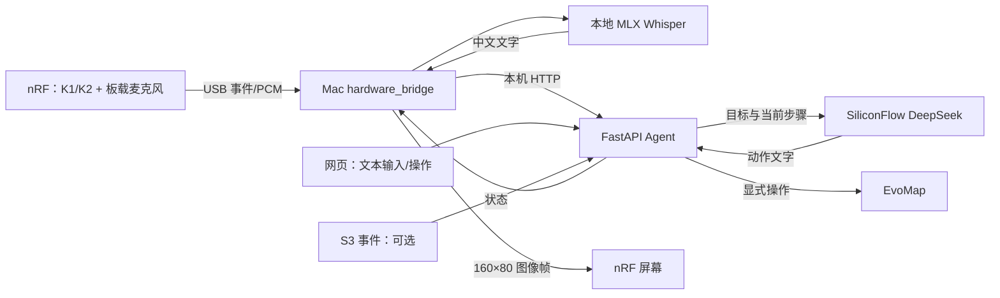
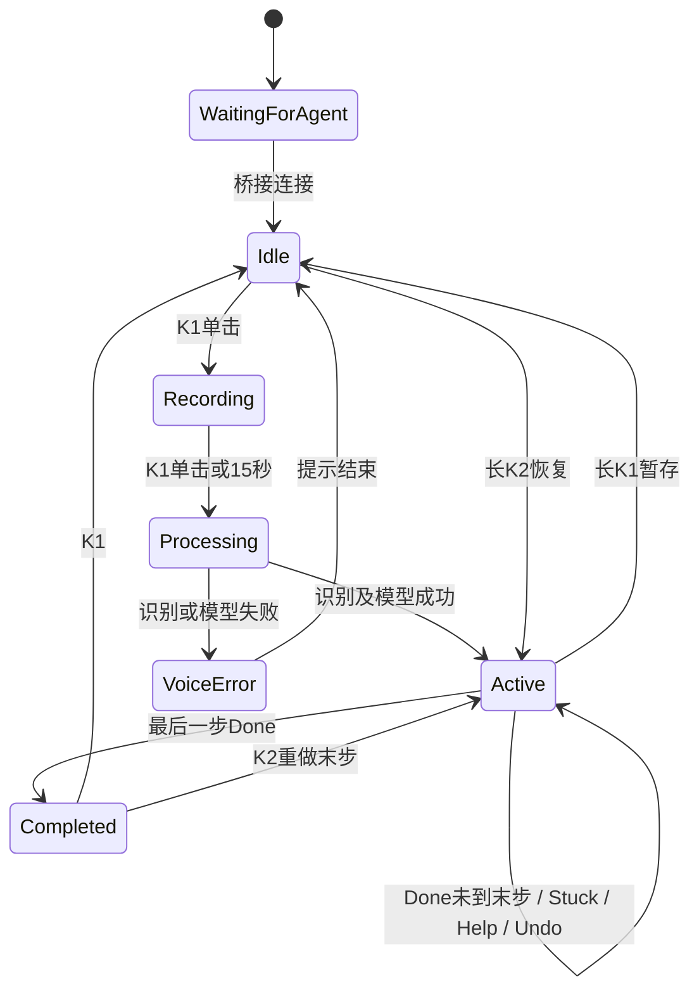

# MindLoop（启念）团队与 UI 交接文档

> 更新时间：2026-09-23；依据：当前代码、串口与烧录记录、真实模型请求和自动测试。  
> 面向：UI/交互设计、前端、后端、嵌入式、现场演示同学。  
> 当前基线：nRF 固件 **mindloop-0.7**；S3 **mindloop-s3-0.2**；后端 `/health.version` 仍为 **0.3.0**，这是不同组件的版本，不表示固件未更新。  
> 本文是本轮最新交接入口。旧交接、README、OPERATIONS 中“仅 mock”“未实现触觉协议”“K2 长按求助”等表述已过时。本文标注“建议/待实现”的内容不能当作已有接口使用。

## 1. 产品定位与可演示闭环

帮助用户把一个目标变成现在能做的一小步，通过穿戴屏幕和两个按键持续推进。

**说出/输入目标 → 生成 3–5 个步骤 → 每次显示一个步骤 → 完成/卡住/换法 → 下一步 → 完成。**

现在是“Mac + 穿戴板 + 云端任务模型”的原型，不是能脱离电脑独立运行的设备。不做疾病诊断；当前注意力漂移只是规则判断/模拟事件，不是经过验证的注意力测量。

## 2. 功能完成度：UI 必须照此标识

| 功能 | 当前实际能力 | UI 与演示边界 |
|---|---|---|
| 设备屏幕 | 160×80 横屏；中文由 Mac 栅格化后发到板子；长内容分页 | 每屏一个当前动作，不将网页布局直接缩小 |
| K1/K2 | 单击、双击、长按；按任务状态路由 | 具体矩阵见第 4 节 |
| 设备语音 | nRF 板载麦克风 → USB PCM → Mac 本地 Whisper 中文识别 | 真实链路；每段最多 15 秒；没有识别原文确认页 |
| 任务生成 | SiliconFlow `deepseek-ai/DeepSeek-V4-Flash` | 已真实请求成功，动态生成，不再固定模板 |
| 卡住/换法 | 当前目标和当前步骤发送模型，生成更小步骤/替代步骤 | 云端失败返回错误，不静默回退模板 |
| 任务暂存 | 长 K1 返回待机前保留最近一份任务，可恢复原步骤 | 进程内保存；不是任务列表，不保证重启后恢复 |
| 撤回 | 返回上一步 | 不是撤销任意修改；不能撤销卡住/换法造成的文本替换 |
| 震动 | 已有 DRV2605L 协议和桥接 | 当前实机 `haptic=false`，未初始化成功，不能展示为已振动 |
| 光/语音干预 | 后端可产生 light/voice 状态 | 当前模拟；没有实体灯效控制或 TTS 播放闭环 |
| S3 BLE 桥 | 已有握手、按钮、屏幕转发与历史实测 | 曾发生断线；当前体验使用 nRF USB 直连，不作为稳定唯一链路 |
| Mac 上下文 | 手动读取前台 App 名/窗口标题，关键词规则判漂移 | 不是持续监控、视觉识别或大模型注意力判断 |
| reSpeaker | 有独立测试脚本及历史测试记录 | 未接入当前 K1 语音输入链路；当前枚举需另查 |
| 摄像头/IMU | 规划及部分设备/协议基础 | 未形成真实传感器到 Agent 的闭环 |
| EvoMap | 本地 Bundle、注册/校验/发布接口 | 不自动发布；配置/权限/远端结果需单独验收 |
| 统计 | 首次完成耗时、漂移/回归、Done/Stuck 次数等 | 原型指标，不是临床或可靠生产分析系统 |

## 3. 架构、输入来源与数据去向



- 当前网页：`http://127.0.0.1:8000`；接口文档：`/docs`，机器 schema：`/openapi.json`。
- nRF 的录音不直接上传 SiliconFlow。先在 Mac 临时 WAV 中完成识别，转写函数结束后删除临时文件；音频缓冲仍可能暂留进程内存，不是安全擦除。
- 识别文字成为任务目标；创建步骤会上传目标文字，卡住/换法会上传目标和当前步骤。API Key 留在后端 `.env`，不得放前端、截图、文档或版本库。
- 桥接日志包含识别文字，Agent 本地 `mindloop/data/memory.json` 记录部分操作事件；新任务事件可能包含前一个目标。不要承诺“完全不留记录”。
- **网页“语音”按钮是另一条链路**：使用浏览器 Web Speech API，结果只填入输入框，用户还需点“开始”。识别服务及音频处理由浏览器实现决定，不能套用“本地 Whisper、不上传音频”的说明。
- 网页不要直接访问串口；硬件事件先经桥接变成 HTTP 操作，与网页共用同一个任务状态。

## 4. 用户操作说明与按键矩阵

### 4.1 一次正常体验

1. Mac 启动 Agent 和 USB bridge，nRF 接数据 USB。
2. 开机显示 `MindLoop Ready / Connect computer / Waiting for Agent`；这是等待连接，**此时不表示可以录音**。
3. 桥接成功后显示“按 K1 开始语音输入”。
4. 单击 K1，说具体目标，例如“我要准备明天五分钟的项目汇报”。
5. 再单击 K1 结束；最长 15 秒会自动停止。说完后等待识别和云端生成。
6. 屏幕显示第一步；单 K1 完成，单 K2 卡住，双 K2 换法。
7. 所有步骤完成后显示完成页。K1 回待机准备新任务，K2 重做最后一步。

### 4.2 全状态按键表

| 状态 | K1 单击 | K1 双击 | K1 长按 | K2 单击 | K2 双击 | K2 长按 |
|---|---|---|---|---|---|---|
| 等待连接 | 无录音业务处理 | 同左 | 同左 | 同左 | 同左 | 同左 |
| 待机 idle | 开始录音 | 不可用提示 | 不可用提示 | 不可用提示 | 不可用提示 | 恢复暂存；无任务则提示 |
| 录音 recording | 停止录音 | 忽略 | 忽略 | 忽略 | 忽略 | 忽略 |
| 停止/识别 stopping/transcribing | 忽略 | 忽略 | 忽略 | 忽略 | 忽略 | 忽略 |
| 执行 action_ready/focus/drift | 完成下一步 | 返回上一步 | 暂存并返回待机 | 缩小当前步骤 | 替换为另一种方法 | 不可用提示 |
| 完成 completed | 回待机 | 不可用提示 | 不可用提示 | 重做最后一步 | 不可用提示 | 不可用提示 |
| 语音错误提示 | 在后端仍为 idle 时可重录 | 依后端任务状态路由 | 同左 | 同左 | 同左 | 同左 |

- 单击松手后等待约 **350ms** 才确认，以区分双击。
- 长按至少 **800ms**，**松手后触发**，不是按住到阈值立即执行。
- 第一动作不能撤回，显示“已是第一步，无法撤回”。完成页若想重做末步，用 K2 单击。
- “恢复上次任务”与“重做最后一步”是不同文案：待机恢复暂存的索引，完成页重新打开末步。
- 最近暂存只有一份。创建更多任务会覆盖最近暂存，不具备多任务管理。
- 网页直接“开始”可以替换当前任务，当前接口没有确认/冲突保护。新 UI 必须提醒或先执行暂存；不能把它描述为已自动保留。

## 5. UI 页面与状态设计对齐

### 5.1 实际存在的两套状态

**后端业务状态（`GET /api/state.state`）**：`idle`、`action_ready`、`drift`、`focus`、`completed`。

**桥接内部显示状态**：`voice_recording`、`voice_stopping`、`voice_transcribing`、`voice_error`、`notice`。这些只是桥接渲染时覆盖的临时状态，**当前 `/api/state` 不返回它们**。固件还有等待连接/失联画面。

因此，网页看到 `idle` 不等于没有录音；不能仅据此允许用户同时创建任务。



图中 Processing 包括本地识别与云端生成，但目前没有独立 `generating` 接口状态。

### 5.2 建议 UI 页面（设计目标，按接口能力分期）

| 页面 | 主信息 | 主操作 | 实现依赖 |
|---|---|---|---|
| 连接/设备页 | Agent 是否可达、设备连接与能力 | 连接说明、重试 | Agent 健康可读；设备完整状态接口待补 |
| 待机/目标输入 | 一个输入框、示例目标 | 开始；可恢复时显示恢复 | 已有接口 |
| 录音页 | 正在听、已录时长、15秒上限 | 结束录音 | 设备有；网页控制/状态接口待补 |
| 识别确认页 | “识别到：…”可修改 | 确认、重录 | **未实现**，不要直接设计成现成流程 |
| 生成中 | 正在整理步骤 | 防重复提交 | 前端可管理 HTTP loading；跨端生成状态待补 |
| 当前动作页 | 当前一句动作、任务目标、done/total | 完成、卡住、换法；次级撤回/暂存 | 已有接口 |
| 完成页 | 完成反馈 | 新任务、重做最后一步 | 已有接口 |
| 错误页/提示 | 可理解的错误原因 | 返回或重试 | HTTP detail 可用；部分桥接错误未同步网页 |
| 历史/统计 | 当前指标与日志 | 查看 | 不具备真正历史任务列表 API |
| 扩展/开发页 | S3、上下文、EvoMap、原始状态 | 显式测试/发布 | 建议与普通用户任务页分开 |

### 5.3 小屏约束

- 横屏 **160×80**；顶部任务进度，正文当前动作，底部操作提示。
- 当前中文正文字号 14，底部 10；正文每页最多 3 行，约 4 秒轮换页面/提示。
- 长按说明：页面文案写“长按后松开”。“撤回”写“上一步”，避免暗示能撤销所有变化。
- 录音时固件会先显示英文 `Listening... / Press K1 to finish`；USB 桥接可能覆盖为中文。S3 录音阶段为避免音频争用会暂停屏幕大帧，保留本地英文页。
- 不把 `device_state.haptic` 显示成“设备震动成功”；它只是模拟器状态。

## 6. 已有 HTTP 接口契约

Base URL：`http://127.0.0.1:8000`。JSON 请求用 `Content-Type: application/json`。默认同源使用，无鉴权，也没有现成跨域配置。前端独立开发端口应配置开发代理；不要直接开放给公网。

| 方法与路径 | 请求 | 成功结果/语义 |
|---|---|---|
| GET `/health` | 无 | `ok,version,agent_provider,evomap`；不是设备在线证明 |
| GET `/api/state` | 无 | 完整当前任务状态 |
| POST `/api/session/start` | `{"goal":"准备项目汇报"}` | 调模型并创建新任务；空目标 400 |
| POST `/api/session/new` | 无 body | 暂存已有任务，返回 idle |
| POST `/api/session/continue` | 无 body | 只允许 idle/completed；无任务或活动任务时 409 |
| POST `/api/session/undo` | 无 body | 返回上一索引；首步/完成态 409 |
| POST `/api/feedback` | `{"feedback":"done"}` | 完成，可能进入 completed |
| POST `/api/feedback` | `{"feedback":"stuck"}` | 模型缩小当前动作，替换原动作 |
| POST `/api/feedback` | `{"feedback":"help"}` | 模型换法，替换原动作 |
| POST `/api/signal/drift` | 无 body | 活动任务进入 drift；无任务 400 |
| POST `/api/signal/refocus` | 无 body | 有当前动作时进入 focus |
| POST `/api/context/check` | 无 body | 状态 + `context` + `drift` 判断 |
| GET `/api/metrics` | 无 | 当前指标对象 |
| POST `/api/hardware/s3` | 见后文 | S3 状态更新/漂移事件 |
| GET `/api/evomap/status` | 无 | 配置状态，不能返回/显示密钥 |
| GET `/api/evomap/bundle` | 无 | 本地预览 Gene/Capsule Bundle |
| POST `/api/evomap/register` | 无 body | 外部注册操作 |
| POST `/api/evomap/validate` | 无 body | 外部校验操作 |
| POST `/api/evomap/publish` | `{"confirm":true}` | 外部发布；必须用户明确确认 |
| POST `/api/demo/reset` | 无 body | 创建固定演示目标，但步骤仍由当前模型生成 |

云端超时/HTTP 拒绝/无有效输出通常返回 **502 + `{"detail":"中文说明"}`**。非法请求体可能 422。UI 需同时处理网络异常与非 2xx；loading 必须结束，不能把失败视为完成。

### 6.1 任务状态示例（说明用，不是固定模型输出）

```json
{
  "goal": "准备五分钟汇报",
  "state": "action_ready",
  "actions": [{"text":"写下汇报主题", "seconds":60}],
  "index": 0,
  "current_action": "写下汇报主题",
  "history": [],
  "intervention": {"channel":"haptic", "pattern":"short"},
  "can_resume": false,
  "progress": {"done":0,"total":1,"fraction":0.0},
  "metrics": {},
  "device_state": {"light":"off","haptic":"short","voice":null},
  "s3_node": {"online":false,"last_event":null,"last_seen":null}
}
```

- `index` 从 0 开始；用 `progress` 展示完成进度。completed 的 `current_action=null`。
- `can_resume` 已可用于恢复按钮；活动任务时为 false，完成页为 true。
- `seconds` 当前云端路径统一赋值 60，是建议时长；**没有运行中的倒计时或自动完成机制**。
- `history` 是当前会话事件，不是跨重启历史任务库。`device_state` 可保留先前模拟值，不是物理设备实时快照。
- `metrics`：`task_initiation_latency_s`（首次 Done 时间差）、`return_to_task_time_s`、`drift_events`、`refocus_successes`、`intervention_success_rate`、`stuck_events`、`done_events`。null 应显示“暂无”，不要显示为 0。暂存恢复未完整恢复指标；反复 refocus 可重复计数，不能把成功率当可靠评估结果。

### 6.2 前端接入例子

```js
async function api(path, body) {
  const res = await fetch(path, body === undefined ? undefined : {
    method: 'POST', headers: {'Content-Type': 'application/json'},
    body: JSON.stringify(body)
  });
  const data = await res.json();
  if (!res.ok) throw new Error(typeof data.detail === 'string' ? data.detail : '操作失败');
  return data;
}
const state = await api('/api/state');
const next = await api('/api/feedback', {feedback: 'done'});
// 无 body 的 POST 单独指定 method，例如 session/new。
```

当前网页只在首次载入/自己发起操作后刷新，**没有持续轮询/WebSocket/SSE**，所以硬件按键后的变化可能不显示。新 UI 可先实现串行约 1 秒轮询 `/api/state`，失败退避，页面不可见时暂停；避免旧 GET 响应覆盖刚完成的 POST 结果。设备语音状态不能靠此轮询补出来，需要第 7 节新接口。

## 7. 跨功能对齐：待实现契约与风险

以下是后续工作建议，不是本次新增功能。

| 优先级 | 对齐事项 | 当前缺口 | 责任边界建议 |
|---|---|---|---|
| P0 | 网页与实体按键同步 | 网页没有持续刷新 | 前端轮询；后端后续提供事件流 |
| P0 | 跨端录音/生成状态 | voice_mode 只在 bridge 内；网页仍看到 idle | bridge 上报，后端统一状态，前端消费 |
| P0 | 录音/模型请求时禁止冲突 | 桥接按键已锁，但网页可同时开始/新建；HTTP 等待期间桥接主循环阻塞 | 后端忙状态与操作锁；bridge 异步请求/取消机制 |
| P0 | 慢模型期间保持设备在线 | 固件 8 秒无 hello/frame 可显示失联；模型请求最长约20秒，bridge 等待时可能不发心跳 | 心跳独立任务，不与模型调用共用阻塞循环 |
| P0 | 语音原文确认 | 识别后自动创建，没有确认页 | 后端保存草稿、确认/重录接口；UI设计 |
| P1 | 错误后重试 | 模型失败后不保留专门可确认的语音草稿 | 区分重试生成与重新录音 |
| P1 | 设备状态可信化 | `/health` 只表示服务；S3 online 没有超时自动置 false；无统一 nRF 状态 API | 上报 last_seen、capabilities、实际 transport |
| P1 | 请求顺序/幂等 | 连续 Done、跨端请求可能推进多步；当前无 session revision/idempotency key | 后端检查会话版本，前端禁重复请求 |
| P1 | 任务持久化 | 内存任务/单份暂存，进程重启丢失 | 后端定义 task_id 与存储，UI再做历史列表 |
| P1 | 触觉事件 | 当前按 pattern 去重，同一种 short 连续出现不一定重新发送 | 使用干预事件 id，别按字符串变化代表一次事件 |
| P1 | S3 音频 USB 断线 | 主 reader 有检查，voice_reader 的退出处理仍需加强；缺语音 USB 时可能发到 BLE 后被拒绝 | bridge 统一监控两路连接与能力 |
| P2 | 无任务上下文检测 | 当前只检查 goal；completed 仍有 goal，可能被切到 drift | 后端限定活动任务；前端先禁用 |
| P2 | 指标与日志 | 失败操作可能已先记录反馈，撤回/恢复指标不完整 | 明确成功事件提交时机与指标定义 |

### 建议新增的统一状态（需后端实现后才能调用）

```json
{
  "session_id": "opaque-id",
  "revision": 12,
  "task_state": "idle",
  "interaction": {
    "phase": "recording",
    "busy": true,
    "recording_elapsed_ms": 3200,
    "recording_limit_ms": 15000,
    "transcript": null,
    "error": null
  },
  "device": {
    "connected": true,
    "transport": "usb",
    "firmware": "mindloop-0.7",
    "last_seen": 0,
    "capabilities": {"display":true,"microphone":true,"haptic":false}
  }
}
```

建议 phase 枚举：`waiting_device / idle / recording / stopping / transcribing / confirming / generating / ready / error`。明确区分本地转写和云端生成。建议草稿确认后再调用 session/start，重录不应覆盖正在执行的任务。具体 URL 尚未落地，不要在前端硬编码猜测。

## 8. 与扩展功能如何交接

### S3、漂移与上下文

- 当前主体验仅需 nRF USB；S3 不承担当前语音上传或 Wi-Fi 云端推理。
- S3 输入格式：`event` 必填，可选 `firmware,node,seq,uptime_ms,source,reason`；支持 `hello,heartbeat,pong,context,drift`。
- `POST /api/hardware/s3` 的 drift 在活动任务触发干预。`context` 只是记录节点状态，不等于自动完成语义理解。
- nRF USB bridge + 独立 s3_bridge 可作为扩展组合；若使用 hardware_bridge `--transport s3`，不要再启动另一个占用同一 S3 端口的进程。
- `s3_node.online=true` 可能陈旧，UI 至少结合 last_seen 展示“最近收到消息”，不要只显示绿灯。

### 干预、震动、灯光与语音输出

- drift → `haptic/double_soft`；completed → `haptic/success`；普通步骤 → `haptic/short`；focus → `light/focus`；重复卡住可产生 `voice/gentle` 文案。
- 当前 DRV2605L 不可用；语音干预没有声音播放器；灯光没有已验收的实体实现。UI 可展示“建议干预/模拟”，不能声称执行成功。
- 触觉接线约定：nRF 3V3→VIN、GND→GND、D4→SDA、D5→SCL，驱动 OUT±→LRA。驱动地址 0x5A，只在启动初始化；具体实物接线仍待核验。

### EvoMap

- 与 SiliconFlow 是两个独立服务：SiliconFlow 生成动作；EvoMap 用于策略/经验 Bundle。
- 当前仅用户显式点击触发注册、校验、发布；普通任务操作不自动发布。
- 发布前预览 Bundle、校验并获得用户确认。不要将 API key/node_secret 交给前端。
- UI 把 EvoMap 放独立扩展入口，不作为完成一个任务的必经流程。

## 9. 本机启动、部署与配置

项目目录：`/Users/lirc/VSCode/EvoMap/mindloop_v0_3`。其他同学用自己的项目绝对路径替换。

### 已有程序运行时

先打开 `http://127.0.0.1:8000`，检查 `/health`。不要直接重复一键启动：当前脚本会再开服务和 bridge，可能出现端口占用/串口争用。

```bash
lsof -nP -iTCP:8000 -sTCP:LISTEN
pgrep -fl mindloop.hardware_bridge
```

每块串口仅一个读写程序；停止进程前确认 PID，不要批量结束其他 Python 程序。

### 冷启动：两终端方式最清楚

终端 A：

```bash
cd /Users/lirc/VSCode/EvoMap/mindloop_v0_3
.venv/bin/python -m uvicorn mindloop.app:app --host 127.0.0.1 --port 8000
```

终端 B：

```bash
cd /Users/lirc/VSCode/EvoMap/mindloop_v0_3
.venv/bin/python -m mindloop.hardware_bridge --transport usb
```

一个 nRF 时自动识别端口。需要指定时先枚举，不要沿用历史端口：

```bash
.venv/bin/python -m serial.tools.list_ports -v
.venv/bin/python -m mindloop.hardware_bridge --transport usb --port /dev/cu.usbmodem1101
```

本轮端口快照：nRF `/dev/cu.usbmodem1101`；S3 `/dev/cu.usbmodem21201`，插拔后可能变。

冷启动也可用 `./run_demo.command`（默认 USB）；`./run_s3.command` 走 S3 BLE，当前不建议作为现场唯一通路。桥接连接异常会 2 秒后重试，但并非所有错误/所有状态恢复都已覆盖。

### 环境与密钥

Apple Silicon Mac；现有 `.venv`；依赖见 `requirements.txt`。若新机器部署，建立虚拟环境并安装依赖；还需准备本地 Whisper 模型缓存和中文字体。模型缺失会明确失败，不会在录音时自动下载。

`.env` 模板（仅占位符，不是实际凭据）：

```dotenv
AGENT_PROVIDER=openai_compatible
LLM_BASE_URL=https://api.siliconflow.cn/v1
LLM_API_KEY={{SILICONFLOW_API_KEY}}
LLM_MODEL=deepseek-ai/DeepSeek-V4-Flash
```

密钥在团队约定的安全方式下单独交付，不打包 `.env` 或原始 `api.md`。真实云端调用会消耗账户额度。后端默认 mock，启动时必须核对 health 中的 provider；改 `.env` 后重启服务。

### 固件编译与烧录

目标：`Seeeduino:nrf52:xiaonRF52840Plus`，Seeeduino nRF52 1.1.13，项目 vendor Seeed_GFX2 及 ArduinoJson。

```bash
cd /Users/lirc/VSCode/EvoMap/mindloop_v0_3
source .venv/bin/activate
/opt/homebrew/bin/arduino-cli compile \
  --fqbn Seeeduino:nrf52:xiaonRF52840Plus \
  --library firmware/vendor/Seeed_GFX2-1.0.0 \
  --output-dir firmware/build firmware/xiao_nrf52840
/opt/homebrew/bin/arduino-cli upload \
  --fqbn Seeeduino:nrf52:xiaonRF52840Plus \
  --port /dev/cu.usbmodem1101 --input-dir firmware/build
```

先停占串口的 bridge；烧录后重启 bridge。必要时快速双按 RESET 进入 XIAO-BOOT，重新查端口。不要向不同型号板子盲刷。

## 10. 验收证据与操作清单

### 已有验证

- 当前代码最近 **38 项自动测试通过**（模型测试用 mock/桩，不代表 38 次云端测试）。
- SiliconFlow 两个不同目标真实拆解成功；当前服务已切换 `openai_compatible`。
- nRF 0.7 实机握手：display=true、microphone=true、haptic=false；USB 屏幕帧确认成功。
- 0.6 纯录音曾约 5.51 秒 USB 掉线；0.7 将音频临界区从全局关中断改为仅屏蔽 PDM 后，6秒、12秒、15秒自动结束、录音并发屏幕刷新均通过，音频序号连续、dropped=0。
- 上述结果支持录音稳定性修复，但没有读取硬件复位原因，不能把具体异常码/掉电原因写成已证明。
- 仍需团队完整真人语音→云端→按键全流程验收；S3 长时间稳定性、触觉实体反馈不在已通过范围。

### UI 联调验收表

| 场景 | 预期 |
|---|---|
| 服务未开、只有板子通电 | 等待连接，不诱导用户开始录音 |
| 待机单K1，说3–8秒，再单K1 | 录音→处理→与目标匹配的动作 |
| 录音超过15秒 | 自动结束进入识别，不重启 |
| 识别中连续按键 | 不开启新录音，不推进任务 |
| 单K1完成 | 索引和进度推进一次；最后一步进入完成 |
| 单K2卡住/双K2换法 | 动态改写当前步骤，索引不变 |
| 首步双K1 | 提示无法撤回；状态不乱 |
| 执行中长K1，待机长K2 | 恢复到暂存的同一动作 |
| 执行中请求continue | HTTP409，不覆盖当前任务 |
| 完成页单K2 | 重新打开末步，明确显示重做语义 |
| 云端失败 | 提示失败，不悄悄变成固定模板 |
| USB插拔 | bridge重连；记录是否恢复画面、录音状态 |
| 网页和硬件同时操作 | 当前需专项验证；不要宣称已有全局互斥 |
| 震动状态 | 显示不可用，不能因 intervention 字段就显示已执行 |

回归命令：

```bash
AGENT_PROVIDER=mock .venv/bin/python -m unittest discover -s tests -q
.venv/bin/python -m py_compile mindloop/*.py
```

音频稳定性脚本仅用于诊断，先停 bridge；不保存录音，不做语音识别：

```bash
.venv/bin/python scripts/probe_audio_stability.py plain 6 /dev/cu.usbmodem1101
.venv/bin/python scripts/probe_audio_stability.py hello 12 /dev/cu.usbmodem1101
.venv/bin/python scripts/probe_audio_stability.py hello 16 /dev/cu.usbmodem1101
```

第三条应在固件15秒上限自动停止。脚本断言音频分块序号连续、dropped=0 并收到 audio_stop。

## 11. 常见故障与定位入口

| 现象 | 优先排查 |
|---|---|
| Ready / Connect computer / Waiting for Agent | 服务和 bridge 是否运行、正确端口、是否被别的进程占用 |
| 录音中回启动页/USB消失 | 查 bridge 日志、固件是否0.7、复现音频稳定性；与15秒正常停止区分 |
| 语音识别失败 | Whisper缓存、声音强度、录音长度、音频丢块；不要先检查云端 Key |
| 能转文字但没有步骤 | 502 detail、云端余额/权限/模型/网络；20秒模型超时 |
| 网页不跟随硬件 | 现有网页缺持续同步，先刷新；新UI实现轮询 |
| K2没震动 | 当前haptic=false，触觉初始化失败；不等于K2反馈没有发出 |
| 页面声称设备在线但没响应 | `/health`仅服务健康，S3 online可能陈旧，结合串口/last_seen |
| 新任务后找不回旧任务 | 仅一份内存暂存；网页直接start没有暂存保护 |

本轮日志位置（后续重启方式不同可能改变）：`/tmp/mindloop-hardware-usb.log`、`/tmp/mindloop-agent.log`。旧 S3 排查日志 `/tmp/mindloop-hardware-bridge-06.log`。日志可能含任务文字，分享前脱敏。

## 12. 文件与团队分工

| 文件 | 负责内容 | 对接建议 |
|---|---|---|
| `mindloop/dashboard/index.html` | 当前网页 UI、浏览器语音、按钮 | 前端/UI 替换页面，保留 API 语义 |
| `mindloop/app.py` | 状态机、HTTP接口、任务暂存、EvoMap路由 | 后端统一跨端状态和错误契约 |
| `mindloop/agent.py` | SiliconFlow 模型请求、动作解析 | 模型同学优化提示/输出与延迟 |
| `mindloop/hardware_bridge.py` | 串口/BLE、按键路由、语音状态、小屏渲染 | 嵌入式与后端共同维护，UI提供文案/布局 |
| `mindloop/voice.py` | PCM组装、本地Whisper | 音频同学维护，不与网页WebSpeech混淆 |
| `firmware/xiao_nrf52840/xiao_nrf52840.ino` | 按键、屏幕、音频、触觉、USB/BLE | 嵌入式负责人 |
| `firmware/xiao_esp32s3/xiao_esp32s3.ino` | S3扩展及BLE中心 | 扩展设备负责人 |
| `mindloop/context.py` / `device.py` | 上下文规则、模拟干预 | 区分推断与实体执行 |
| `mindloop/evomap_gep.py` | Bundle/注册/校验/发布 | EvoMap负责人，独立验收 |
| `tests/` | 状态/桥接/模型/语音回归 | 所有改动共同维护 |

**建议交付顺序**：先完成任务页、完成页、恢复与错误提示及状态轮询；随后后端补跨端语音/生成/设备状态，UI再接录音确认；最后整合真实触觉、S3传感器与EvoMap。每项都区分“设计稿完成、接口可用、软件测试通过、实体演示通过”。

## 摄像头接入增量（2026-09-23）

网页已加入摄像头选择、本地视频预览、拍照、关闭和清除照片。优先选择 LRCP G720P；浏览器权限需用户允许。视频/照片仅在浏览器当前页面中，不写磁盘、不上传模型、不自动完成任务。需要 localhost 或 HTTPS。此增量取代“没有摄像头网页入口”的旧状态，但视觉理解仍待模型/用途对齐。当前 JS 语法及在线页面内容验证通过；浏览器真实预览/权限验证仍需现场完成。

## 2026-09-24 联合辅助增量

[语音与摄像头联合辅助](VOICE_CAMERA.md)已接入：网页勾选后同步本机最新帧，设备K1语音转写与图像观察共同生成步骤。Qwen3-VL-30B-A3B-Instruct负责视觉、DeepSeek负责动作；真实合成图验证通过，43项测试通过。此更新取代此前“视觉未接入”状态。不是连续视频分析或自动完成判定；真人浏览器端联合流程待现场验收。新增camera/frame接口、generating状态与异步生成避免心跳阻塞。
